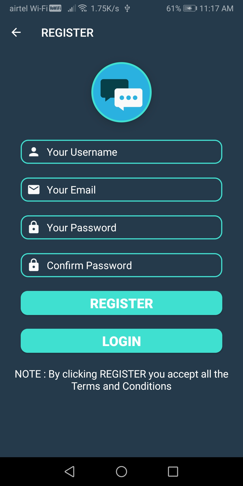

# Description

App Name - **_FireChat_**

One to One Messaging App Using Firebase Realtime Database

# Features 

1. Send and recieve Messages
2. Display Messsages in Recycler View
3. Update Profile Info
4. Get List of all Users
5. Firebase Authentication 

# What did i learned

1. Storing & retreiving information from Firebase Database
2. Image Processing using Glide Library
3. Setting up TabLayout with ViewPager and fragments

# Screenshots

#  Dependencies Used

1. [Glide](https://github.com/bumptech/glide) for Loading Image
2. [Firebase Auth](https://firebase.google.com/docs/auth) for user authentication
3. [Firebase Realtime Database](https://firebase.google.com/products/realtime-database?gclid=Cj0KCQjwvvj5BRDkARIsAGD9vlLZq9Tjonz-lxdZBX1Or2nae2oYrUzXam5AyKW_c8b9w08-lhCWtzsaAqJkEALw_wcB) for storing & retreiving data
4. Material Design Library
